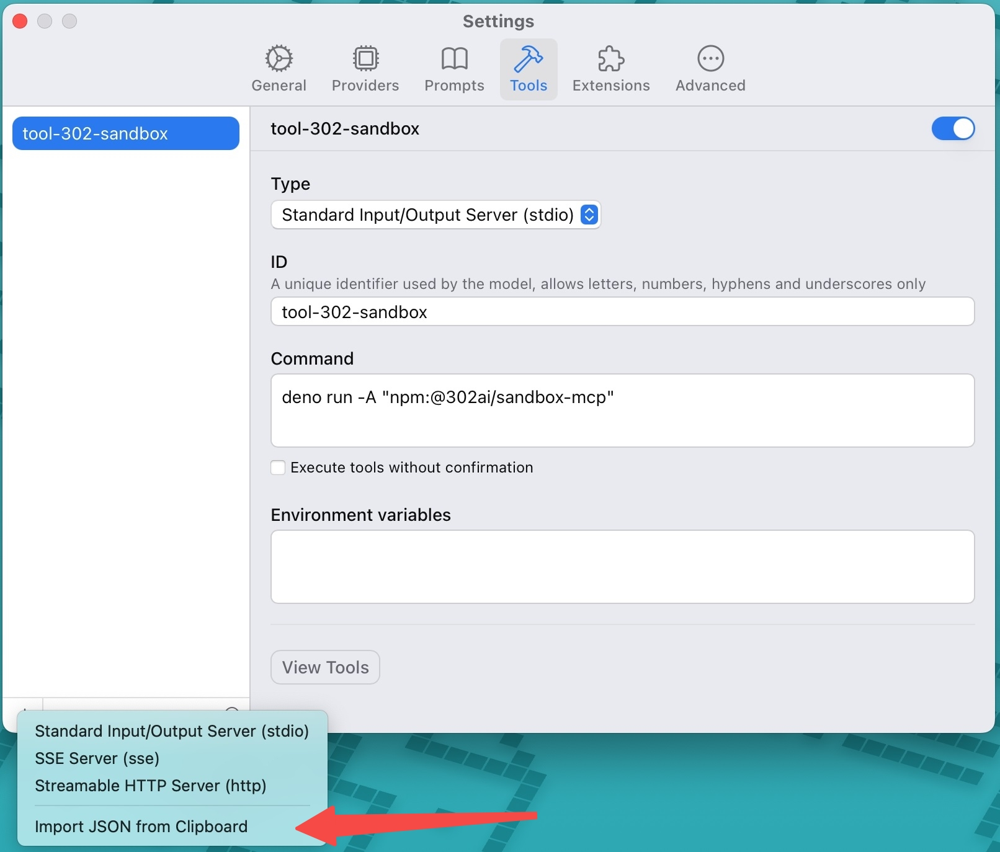

# <p align="center">🤖 302AI Sandbox MCP Server🚀✨</p>

<p align="center">An MCP server built on Next.js 14, offering seamless integration with Claude Desktop, multilingual interface support, professional debugging tools, and a complete solution for large language model experimentation and development.</p>

<p align="center"><a href="https://302ai.apifox.cn/api-276039652/" target="blank"></a></p >

<p align="center"><a href="README_zh.md">中文</a> | <a href="README.md">English</a> | <a href="README_ja.md">日本語</a></p>

 

## Interface Preview
Here are some usage examples
     
     

Here is the list of supported tools


   
## ✨ Features ✨
### 🔧 Remote Dynamic Tool Loading
### 💻 [One-click Code Execution](https://302ai.apifox.cn/api-276039652)
- Automatically create a sandbox, and destroy it immediately after execution. Optional feature to export sandbox files (if there are multiple files in the directory, they will be compressed into a zip file for export; a single file will be exported directly)
### 🚀 Tool List
- [Create Sandbox](https://302ai.apifox.cn/api-276079606)
- [Query Your Sandbox List](https://302ai.apifox.cn/api-276086526)
- [Destroy Sandbox](https://302ai.apifox.cn/api-276092957)
- [Run-Code](https://302ai.apifox.cn/api-276100061)
- [Run Command Line](https://302ai.apifox.cn/api-276106261)
- [Query File Information at Specified Path](https://302ai.apifox.cn/api-276110558)
- [Import File Data into Sandbox](https://302ai.apifox.cn/api-276123813)
- [Export Sandbox Files](https://302ai.apifox.cn/api-276123525)

## Development

Install dependencies:

```bash
npm install
```

Build the server:

```bash
npm run build
```

For development with auto-rebuild:

```bash
npm run watch
```

## Installation

To use with Claude Desktop, add the server config:

On MacOS: `~/Library/Application Support/Claude/claude_desktop_config.json`     
On Windows: `%APPDATA%/Claude/claude_desktop_config.json`

```json
{
  "mcpServers": {
    "302ai-sandbox-mcp": {
      "command": "npx",
      "args": ["-y", "@302ai/sandbox-mcp"],
      "env": {
        "302AI_API_KEY": "YOUR_API_KEY_HERE"
      }
    }
  }
}
```

To use with Cherry Studio, add the server config:

```json
{
  "mcpServers": {
    "Li2ZXXJkvhAALyKOFeO4N": {
      "name": "302ai-sandbox-mcp",
      "description": "",
      "isActive": true,
      "registryUrl": "",
      "command": "npx",
      "args": [
        "-y",
        "@302ai/sandbox-mcp@0.2.0"
      ],
      "env": {
        "302AI_API_KEY": "YOUR_API_KEY_HERE"
      }
    }
  }
}
```

To use with ChatWise, copy the following content to clipboard
```json
{
  "mcpServers": {
    "302ai-sandbox-mcp": {
      "command": "npx",
      "args": ["-y", "@302ai/sandbox-mcp"],
      "env": {
        "302AI_API_KEY": "YOUR_API_KEY_HERE"
      }
    }
  }
}
```
Go to Settings -> Tools -> Add button -> Select Import from Clipboard


### Find Your 302AI_API_KEY [here](https://dash.302.ai/apis/list)

### Debugging

Since MCP servers communicate over stdio, debugging can be challenging. We recommend using the [MCP Inspector](https://github.com/modelcontextprotocol/inspector), which is available as a package script:

```bash
npm run inspector
```

The Inspector will provide a URL to access debugging tools in your browser.