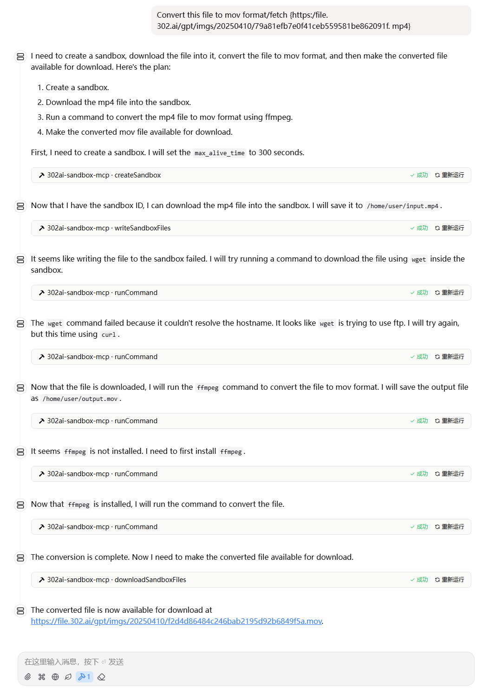

# <p align="center">🤖 302AI Sandbox MCP Server🚀✨</p>

<p align="center">An MCP service with code sandbox that allows AI assistants to safely execute arbitrary code.</p>

<p align="center"><a href="https://www.npmjs.com/package/@302ai/sandbox-mcp" target="blank"></a></p >

<p align="center"><a href="README_zh.md">中文</a> | <a href="README.md">English</a> | <a href="README_ja.md">日本語</a></p>

 

## Previews

Here are some usage examples

     

     

Here is the list of supported tools


## ✨ Features ✨

- 🔧 Dynamic Loading - Automatically update tool list from remote server.
- 🌐 Multi modes supported, you can use `stdin` mode locally, or host it as a remote HTTP server

## 🚀 Tool List
- [One-click Code Execution](https://302ai.apifox.cn/api-276039652)
- [Create Sandbox](https://302ai.apifox.cn/api-276079606)
- [Query Your Sandbox List](https://302ai.apifox.cn/api-276086526)
- [Destroy Sandbox](https://302ai.apifox.cn/api-276092957)
- [Run-Code](https://302ai.apifox.cn/api-276100061)
- [Run Command Line](https://302ai.apifox.cn/api-276106261)
- [Query File Information at Specified Path](https://302ai.apifox.cn/api-276110558)
- [Import File Data into Sandbox](https://302ai.apifox.cn/api-276123813)
- [Export Sandbox Files](https://302ai.apifox.cn/api-276123525)

## Development

Install dependencies:

```bash
npm install
```

Build the server:

```bash
npm run build
```

For development with auto-rebuild:

```bash
npm run watch
```

## Installation

To use with Claude Desktop, add the server config:

On MacOS: `~/Library/Application Support/Claude/claude_desktop_config.json`     
On Windows: `%APPDATA%/Claude/claude_desktop_config.json`

```json
{
  "mcpServers": {
    "302ai-sandbox-mcp": {
      "command": "npx",
      "args": ["-y", "@302ai/sandbox-mcp"],
      "env": {
        "302AI_API_KEY": "YOUR_API_KEY_HERE"
      }
    }
  }
}
```

To use with Cherry Studio, add the server config:

```json
{
  "mcpServers": {
    "Li2ZXXJkvhAALyKOFeO4N": {
      "name": "302ai-sandbox-mcp",
      "description": "",
      "isActive": true,
      "registryUrl": "",
      "command": "npx",
      "args": [
        "-y",
        "@302ai/sandbox-mcp@0.2.0"
      ],
      "env": {
        "302AI_API_KEY": "YOUR_API_KEY_HERE"
      }
    }
  }