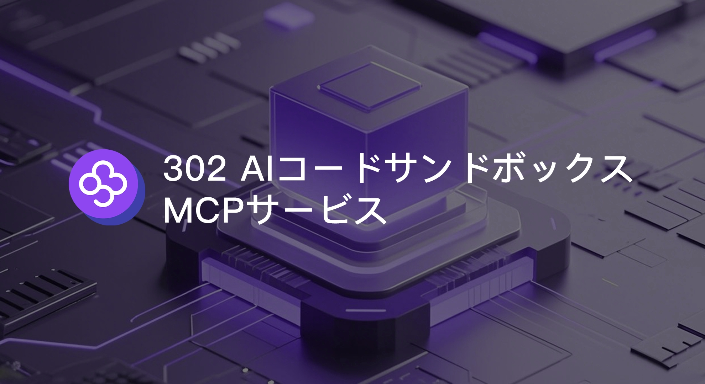
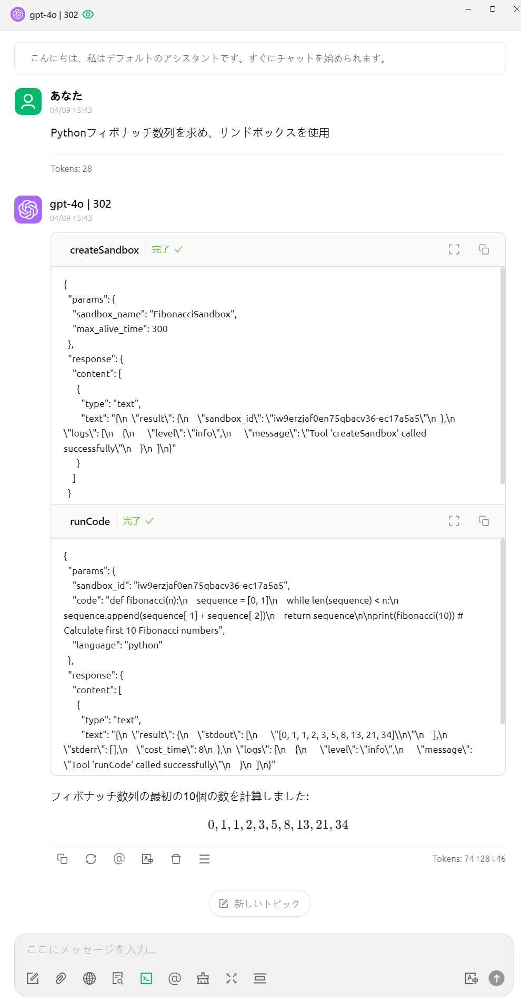
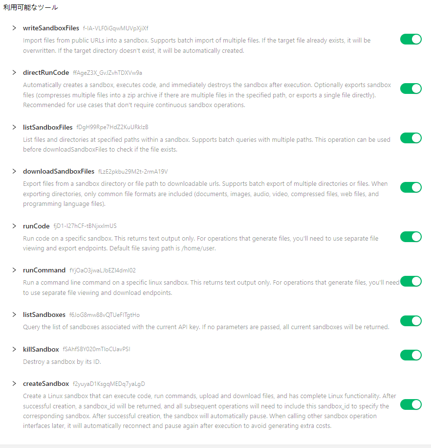
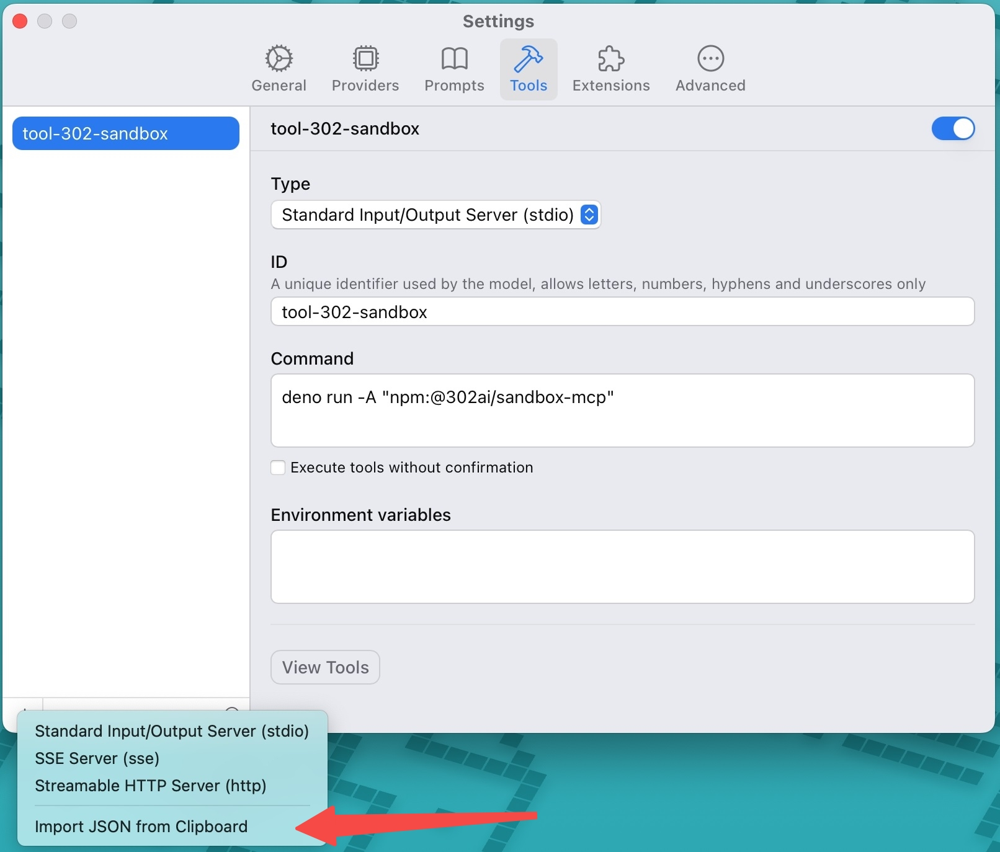

# <p align="center">🤖 302 AIコードサンドボックスMCPサービス🚀✨</p>

<p align="center">AIアシスタントがサンドボックスを使用して安全に任意のコードを実行できるMCPサービスです。</p>

<p align="center"><a href="https://302ai.apifox.cn/api-276039652/" target="blank"></a></p >

<p align="center"><a href="README_zh.md">中文</a> | <a href="README.md">English</a> | <a href="README_ja.md">日本語</a></p>

 

## インターフェースプレビュー
以下は使用例です
     
     

以下は利用可能なツールリストです


   

## ✨ 機能特性 ✨
### 🔧 リモート動的ツール読み込み
### 💻 [ワンクリックでコードを実行](https://302ai.apifox.cn/api-276039652)
- サンドボックスを自動的に作成し、実行後すぐに破棄します。サンドボックスファイルのエクスポート機能を選択可能（ディレクトリに複数のファイルがある場合、圧縮ファイルとしてエクスポートされます。単一ファイルの場合は直接エクスポートされます）
### 🚀 ツールリスト
- [サンドボックスの作成](https://302ai.apifox.cn/api-276079606)
- [自分のサンドボックスリストを照会](https://302ai.apifox.cn/api-276086526)
- [サンドボックスの破壊](https://302ai.apifox.cn/api-276092957)
- [コードの実行](https://302ai.apifox.cn/api-276100061)
- [コマンドラインの実行](https://302ai.apifox.cn/api-276106261)
- [指定パスのファイル情報を照会](https://302ai.apifox.cn/api-276110558)
- [サンドボックスにファイルデータをインポート](https://302ai.apifox.cn/api-276123813)
- [サンドボックスファイルのエクスポート](https://302ai.apifox.cn/api-276123525)

## 開発

依存関係のインストール:

```bash
npm install
```

サーバーのビルド:

```bash
npm run build
```

開発用の自動再ビルド:

```bash
npm run watch
```

## インストール

Claude Desktopで使用するには、サーバー設定を追加してください:

MacOS系统: `~/Library/Application Support/Claude/claude_desktop_config.json`    
Windows系统: `%APPDATA%/Claude/claude_desktop_config.json`

```json
{
  "mcpServers": {
    "302ai-sandbox-mcp": {
      "command": "npx",
      "args": ["-y", "@302ai/sandbox-mcp"],
      "env": {
        "302AI_API_KEY": "YOUR_API_KEY_HERE"
      }
    }
  }
}
```

Cherry Studioで使用するには、サーバー設定を追加してください:

```json
{
  "mcpServers": {
    "Li2ZXXJkvhAALyKOFeO4N": {
      "name": "302ai-sandbox-mcp",
      "description": "",
      "isActive": true,
      "registryUrl": "",
      "command": "npx",
      "args": [
        "-y",
        "@302ai/sandbox-mcp@0.2.0"
      ],
      "env": {
        "302AI_API_KEY": "YOUR_API_KEY_HERE"
      }
    }
  }
}
```

ChatWiseで使用するには、以下の内容をクリップボードにコピーしてください
```json
{
  "mcpServers": {
    "302ai-sandbox-mcp": {
      "command": "npx",
      "args": ["-y", "@302ai/sandbox-mcp"],
      "env": {
        "302AI_API_KEY": "YOUR_API_KEY_HERE"
      }
    }
  }
}
```

設定->ツール->追加ボタン->クリップボードからインポートを選択


### [ここ](https://dash.302.ai/apis/list)で302AI_API_KEYを取得してください

### デバッグ

MCPサーバーは標準入出力(stdio)を介して通信するため、デバッグが難しい場合があります。パッケージスクリプトとして利用可能な[MCP Inspector](https://github.com/modelcontextprotocol/inspector)の使用をお勧めします:

```bash
npm run inspector
```

InspectorはブラウザでデバッグツールにアクセスするためのURLを提供します。
